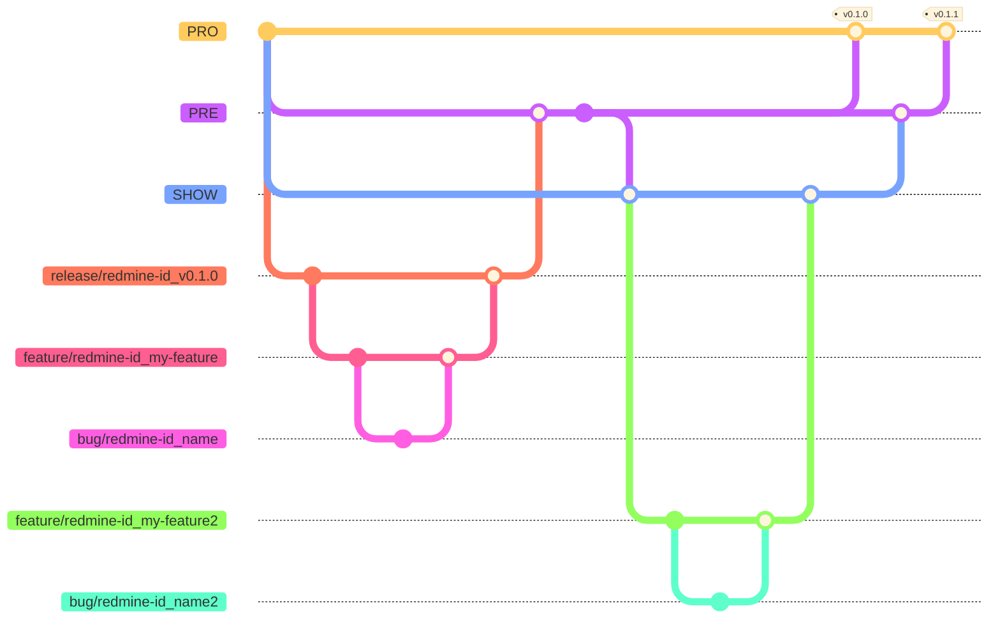

# Branching Strategy

## PRO, PRE and SHOW
These 3 branches are our key branches. PRO branch will be our master and PRE branch our development branch. SHOW branch is independent from PRE and PRO as it may have some extra features implemented, but eventually it can be merget into PRE (always PRE before PRO). The only branch that can be merged into PRO is PRE, so that we can always test the code in PRE before deployment.

## Branch naming
Branches can be named as follows depending on the objective:
* **feature/{redmine-id}_{name}**: These branches are used when adding new functionalities to the code. Each feature needs to be in different branches, and a redmine (or linear o whatever tool we use) ticket id must be associated to the branch.
* **bug/{redmine-id}_{name}**: These branches are used for bug fixing. Each bug needs to have its own branch and redmine ticket id.
* **release/{redmine-id}_{vesion-id}**: If a bigger project is started involving multiple featuers, a release branch will be created from PRE. This branch will handle all feature/bug branches related with the release, and finally will be committed back to PRE (and after testing to PRO).

## Tagging
After every PRE --> PRO merge, a tag will be created with the old version, so that we can always go back.

## Versioning
Each release branch will increment 0.1.0 or 1.0.0 the last version (depending on the volume of changes applied on the release). Moreover, every feature branch on PRE will increment 0.0.1 the last version. Every SHOW --> PRE merge can increment 0.1.0 or 0.0.1 depending on the magnitude of the changes.

## Flow Example

