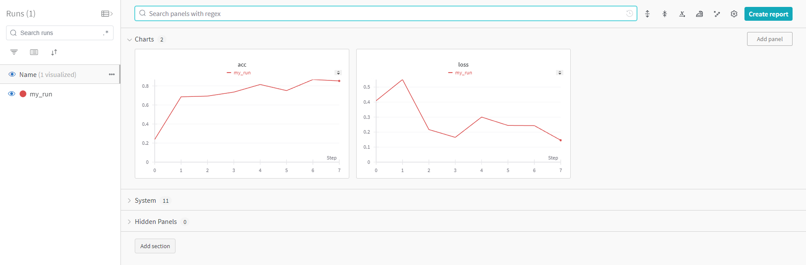

# Code guidelines

## Filesystem

```
project_name/
│
├── data/
│   ├── raw/
│   └── processed/
│
├── notebooks/
│   ├── exploratory/
│   └── reports/
│
├── src/
│   ├── __init__.py
│   ├── data/
│   │   ├── __init__.py
│   │   └── {data_processing_files}
│   ├── models/
│   │   ├── __init__.py
│   │   └── {model_related_files (training/evaluating)}
│   └── utils/
│       ├── __init__.py
│       └── {helper_files}
│
├── tests/
│   ├── __init__.py
│   └── test_*.py
│
├── scripts/
│   └── {independent_files}
│
├── configs/
│   └── config.ini
│
├── reports/
│   └── figures/
│
├── poetry.lock
├── pyproject.toml
├── dockerfile
├── README.md
├── .dockerignore
└── .gitignore
```

## Directory and File Description

### `data/`
- **raw/**: Original, immutable data dumps.
- **processed/**: Cleaned data ready for analysis.

### `notebooks/`
- **exploratory/**: Jupyter notebooks for exploratory data analysis (EDA).
- **reports/**: Jupyter notebooks that generate project reports and visualizations.

### `src/`
- **data/**: Modules for data handling (loading/preprocessing/splitting).
- **models/**: Modules for modeling (training/evaluating).
- **utils/**: Utility functions and helpers (separated in files by purpose).

### `tests/`
- **test_*.py**: Unit tests for the project modules.

### `scripts/`
- Independent scripts.

### `configs/`
- **config.ini**: Configuration file for managing project settings.

### `reports/`
- **figures/**: Generated figures and plots.

### Project Root
- **README.md**: Project documentation and instructions.
- **poetry.lock**: Poetry manager version control.
- **pyproject.toml**: Poetry project configuration.
- **dockerfile**: Docker container building configuration.
- **.dockerignore**: Docker ignore file to exclude unnecessary files from docker.
- **.gitignore**: Git ignore file to exclude unnecessary files from version control.

## Applying SOLID Principles

### Single Responsibility Principle (SRP)
- Each module and function should have a single responsibility.
- **Example**: `preprocess_data.py` only handles data cleaning, not loading or splitting.

### Open/Closed Principle (OCP)
- Modules should be open for extension but closed for modification.
- **Example**: New data loading methods can be added in `load_data.py` without altering existing functions.

### Liskov Substitution Principle (LSP)
- Objects of a superclass should be replaceable with objects of a subclass without affecting the correctness.
- **Example**: Use consistent data structures and interfaces for data functions so they can be interchanged.

### Interface Segregation Principle (ISP)
- Specific interfaces are better than a single general-purpose interface.
- **Example**: Instead of having a single module that handles multiple aspects of feature engineering and selection, we create separate modules for each task. This keeps interfaces focused and avoids creating large, cumbersome interfaces that force clients to depend on methods they do not use.

### Dependency Inversion Principle (DIP)
- Depend on abstractions, not on concrete implementations.
- **Example**: Use configuration files (`config.yaml`) to manage settings and dependencies instead of hardcoding them in scripts.

## Additional Best Practices
- **Modularity**: Break down the project into small, manageable, and reusable pieces.
- **Documentation**: Maintain a comprehensive `README.md` and docstrings for all functions and classes.
- **Using Pydantic instead of dataclasses**: 
    - **Data Organization**: Use pydantic to define and manage structured data easily.
    - **Example**:
        ```python
        from pydantic import BaseModel, EmailStr

        class User(BaseModel):
            id: int
            name: str
            email: EmailStr

        # Validation with strict types
        try:
            user = User(id='1', name='John Doe', email='john.doe@example.com')
            print(user)
        except ValidationError as e:
            print(e.json())
    - **Key features of Pydantic**:
        - *Data Validation*: Pydantic allows you to define data models using Python type annotations. It automatically validates the data against these models, ensuring that it conforms to the specified structure and data types.

        - *Settings Management*: It can be used for managing application settings by defining settings models with default values and validation rules.

        - *Automatic Conversion*: Pydantic can automatically convert raw input data into Python objects based on the specified data model. It handles type conversion, coercion, and parsing seamlessly.

        - *Error Reporting*: When validation fails, pydantic provides detailed error messages indicating the nature of the validation error, making it easier to diagnose and fix issues.

        - *Integration with Python Ecosystem*: Pydantic integrates well with other Python libraries and frameworks such as FastAPI, a modern web framework for building APIs with Python.

        - *Extensibility*: Pydantic is designed to be extensible, allowing you to customize validation rules and behaviors to suit your specific needs.

- **Using Decorators**: 
    - **Code Reusability**: Use decorators to add functionality to functions or methods in a reusable way.
    - **Example**:
    ```python
    from functools import wraps
    import time

    def timing_decorator(func):
        @wraps(func)
        def wrapper(*args, **kwargs):
            start_time = time.time()
            result = func(*args, **kwargs)
            end_time = time.time()
            print(f"Function {func.__name__} took {end_time - start_time} seconds")
            return result
        return wrapper

    @timing_decorator
    def example_function(x):
        return x * x
- **Logging**: Implement logging to keep track of the application’s runtime behavior. Use `utils.logger`.
- **Inline Documentation**: Write docstrings for all functions, classes, and modules.
- **Code formatting**: Use *black* for code formatting so that it follows standards.
    - **Instalation**: 
        ```bash
        poetry add black
    - **Usage**:
        ```bash
        black src/
    - **Configuration**: Refer to [Black Documentation](https://black.readthedocs.io/en/stable/usage_and_configuration/the_basics.html#configuration-via-a-file)
- **Code Linting**: Use *pylint* for code linting
    - **Instalation**:
        ```bash
        poetry add pylint
    - **Usage**:
        ```bash
        pylint src/
    - **Configuration**: Refer to [Pylint Documentation](https://pylint.readthedocs.io/en/latest/user_guide/configuration/index.html)
- **Data Version Control** *(If needed)*: If data is used for modeling, DVC will be used to have some control over versions.
    - **Instalation**:
        ```bash
        poetry add dvc
    - **Usage**: 
        - *Initialization*:
            ```bash
            poetry run dvc init
        - *Add files*:
            ```bash
            poetry run dvc add data/raw/data.csv
        - *Commit and push*:
            ```bash
            git add data/raw/data.csv.dvc
            git commit -m "Add raw data file"
            poetry run dvc push
    - **More info**: [DVC Documentation](https://dvc.org/)
- **Model version control** *(If needed)*: If modeling is used in the project, *wandb* will be used for model version control.
    - **Instalation**:
        ```bash
        poetry add wandb
    - **Usage**:
        - *Login*: Go to [wandb page](https://wandb.ai/site) and create account before login.
            ```bash
            poetry run wandb login
        - *Dummy trainning simulation with wandb logs*:
            ```python
            import wandb
            import random

            # start a new wandb run to track this script
            wandb.init(
                # set the wandb run name
                name = "my_run",
                # set the wandb project where this run will be logged
                project = "test",

                # track hyperparameters and run metadata
                config = {
                    "learning_rate": 0.02,
                    "architecture": "CNN",
                    "dataset": "CIFAR-100",
                    "epochs": 10,
                }
            )

            # simulate training
            epochs = 10
            offset = random.random() / 5
            for epoch in range(2, epochs):
                acc = 1 - 2 ** -epoch - random.random() / epoch - offset
                loss = 2 ** -epoch + random.random() / epoch + offset

                # log metrics to wandb
                wandb.log({"acc": acc, "loss": loss})

            # [optional] finish the wandb run, necessary in notebooks
            wandb.finish()
        - *Results visualization*:         
            
